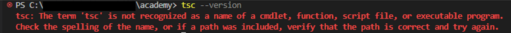
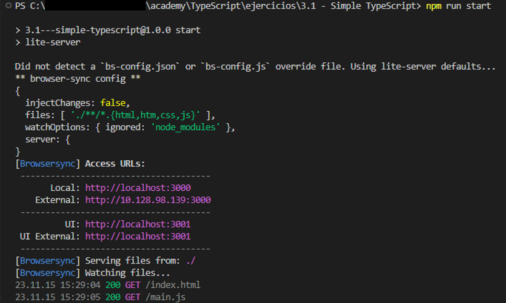
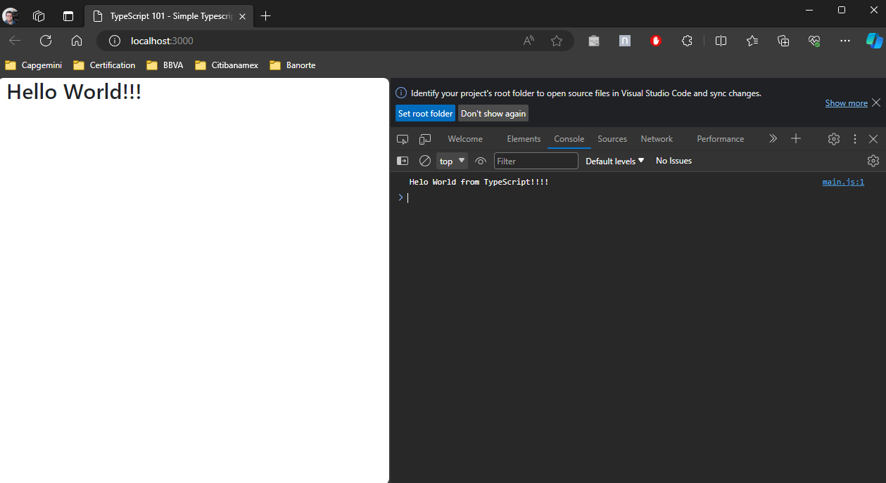

# Simple Typescript

En este ejercicio se ejemplifica el uso básico de TypeScript dentro de un proyecto simple de HTML5.

## Objetivos

Al completar este ejercicio tu deberás ser capaz de:

* Validar que tienes instalado TypeScript.
* Explicar que son los paquetes de NPM.
* Utilizar la línea de comando de TypScript.
* Aplicar TypeScript a un proyecto simple de HTML5.

## Instrucciones

El siguiente ejercicio plantea la siguiente problemática:

***¿Se puede usar TypeScript en más proyectos que no sea solo Angular?***

La respuesta corta es **SI**, y a continuación veremos cómo se puede aplicar TypeScript a un proyecto simple de HTML5.

#### Objetivo 1: Validar que tienes instalado TypeScript

Lo primero que se debemos hacer es validar que tenemos instalado TypeScript en nuestros equipos, ya sea de manera global o local.

Ejecuta los siguientes pasos:

Paso 1: Crea una carpeta en algún lugar de tu sistema de archivos.

Paso 2: Ejecuta una instancia de VSCode y abre esta carpeta en tu IDE.

Paso 3: Dentro de VSCode abre una terminal.

Paso 3: Ejecuta el siguiente comando para validar que tengas TypeScript de manera global.

```bash
tsc --version
```

Si en tu consola te aparece un error similar al que ves en la siguiente imagen, significa que no tienes instalado de manera global TypeScript y para este punto tienes dos opciones *(tienes que escoger una)*:

1. Instalar de manera global TypeScript.
2. Instalar TypeScript.



**Instalación global.**

Ejecuta en tu terminal el siguiente comando para instalar de manera global TypeScript.

```bash
npm install -g typescript
tsc --version
```

**Instalación local.**

Ejecuta en tu terminal el siguiente comando para instalar de manera local (*o por proyecto*) TypeScript.

```bash
npm install typescript --save-dev
npx tsc --version
```

#### Objetivo 2: Explicar que son los paquetes de NPM.

Cualquier proyecto que utilice el gestor de paquetes **npm** de manera directa o indirecta, se considera un *package* que pudiera o no, ser publicado en un repositorio de paquetes como [npmjs](https://www.npmjs.com/).

npm es el mayor repositorio de software del mundo. Los desarrolladores OpenSource de cualquier continente usan npm para compartir piezas de código en forma de paquete que pudieran ser de ámbito público o privado.

npm consiste de tres componentes principales:

* Portal web.
* CLI *(command line interface).*
* Repositorio.

A continuación, veremos cómo usar npm para configurar un pequeño proyecto de npm.

Ejecuta los siguientes pasos:

Paso 1: En la terminal ejecuta el siguiente comando y en cada pregunta deja los valores por defecto *(presiona siempre la tecla `<ENTER>`)*.

```bash
npm init
```

Paso 2: En la terminal ejecuta el siguiente comando.

```bash
npm install --save-dev lite-server
```

Paso 3: Modifica el archivo `package.json`, localiza la sección `"scripts"` y agrega el siguiente pedazo de código.

```json
"scripts": {
    "start": "lite-server"
  },
```

Paso 4:  Agrega a la raíz de tu carpeta un nuevo archivo llamado `index.html` y agrega el siguiente contenido.

```html
<!DOCTYPE html>
<html lang="en">
  <head>
    <meta charset="utf-8" />
    <meta name="viewport" content="width=device-width, initial-scale=1" />
    <title>TypeScript 101 - Simple Typescript</title>
    <link
      href="https://cdn.jsdelivr.net/npm/bootstrap@5.3.2/dist/css/bootstrap.min.css"
      rel="stylesheet"
      integrity="sha384-T3c6CoIi6uLrA9TneNEoa7RxnatzjcDSCmG1MXxSR1GAsXEV/Dwwykc2MPK8M2HN"
      crossorigin="anonymous"/>
  </head>
  <body>
    <div class="container">
        <div class="row">
            <H1>Hello World!!!</H1>
        </div>  
    </div>
    <script src="main.js"></script>
    <script src="https://cdn.jsdelivr.net/npm/bootstrap@5.3.2/dist/js/bootstrap.bundle.min.js"
      integrity="sha384-C6RzsynM9kWDrMNeT87bh95OGNyZPhcTNXj1NW7RuBCsyN/o0jlpcV8Qyq46cDfL"
      crossorigin="anonymous">
    </script>
  </body>
</html>
```

Paso 5:  Agrega a la raíz de tu carpeta un nuevo archivo llamado `main.ts` y agrega el siguiente contenido.

```typescript
console.log("Helo World from TypeScript!!!!");
```

#### Objetivo 3: Utilizar la línea de comando de TypScript.

Paso 1:  En la terminal ejecuta el siguiente comando.

```bash
tsc main.ts
```

Paso 2:  En la terminal ejecuta el siguiente comando.

```bash
npm run start
```

Paso 3: Hasta es punto deberías ver en tu terminal una salida como la que se muestra en la siguiente imagen.



#### Objetivo 4: Aplicar TypeScript a un proyecto simple de HTML5.

Paso 1: Finalmente, en tu explorador deberías poder ver la url `http://localhost:3000/` mostrando el siguiente contenido.



## Resumen

En este ejercicio nos demuestra que podemos aplicar fácilmente TypeScript a cualquier proyecto que utilice JS como base de programación. En este caso, un pequeño proyecto web en el cual, a través de compilar un archivo `*.ts` pudimos generar un archivo `*.js` que fácilmente puede ser integrado a la página web.
