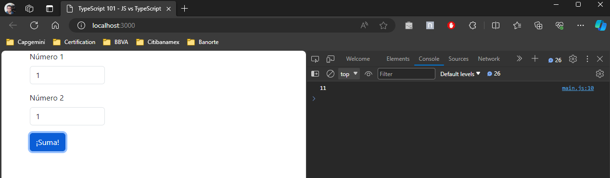
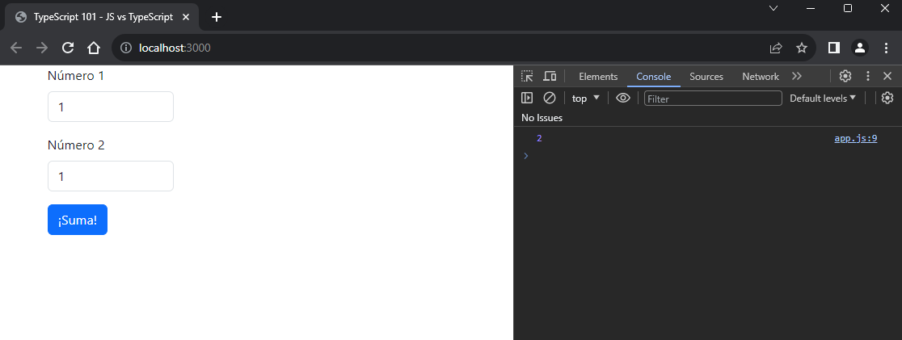

# JS vs TypeScript

En este ejercicio se ejemplifican las principales tipos de datos que tiene TypeScript resaltando las ventajas de este lenguaje sobre JS nativo.

## Objetivos

Al completar este ejercicio tu deberás ser capaz de:

* Reforzar lo visto en el ejercicio anterior (3.1 - Simple TypeScript).
* Entender los beneficios de Typescript.
* Entender los tipos de datos básicos de Typescript.

## Instrucciones

El siguiente ejercicio plantea la siguiente problemática:

***¿Cómo empezar a utilizar Typescript?***

Para resolver esta respuesta iremos desglosando cada uno de los objetivos antes planteados para dar una respuesta mas completa y enfocada a un nivel básico.

#### Objetivo 1: Reforzar lo visto en el ejercicio anterior (3.1 - Simple TypeScript)

Ejecuta los siguientes pasos:

Paso 1: Configura tu entorno de trabajo como en el ejercicio anterior, llamado `3.1 - Simple TypeScript`.

#### Objetivo 2: Entender los beneficios de Typescript

Del ejercicio anterior, el cual puedes localizar bajo el siguiente nombre `3.1 - Simple TypeScript`, pudiste entender que Typescript no solo forma parte de un *framework* o *librería* de JavaScript en particular si no que se trata del mismo JS pero con algunas novedades interesantes que nos permiten diseñar software para cualquier plataforma que permita su ejecución, por ejemplo un **explorador web** o un **servidor** con NodeJS.

Su principal beneficio es que aquellos errores que se pudieran presentar en un código JS se puedan observar durante la fase de desarrollo y no durante la ejecución final, ya que esta situación potencialmente pudiera consumir valioso tiempo que serviría mejor durante el desarrollo.

El siguiente ejercicio contiene dos archivos que a plena vista tiene un nombre muy similar. Veras que existe un arhivo llamado `main.js `y otro llamado `main.ts`. En esencia, ambos archivos contienen la misma lógica pero expresada en función de su lenguaje, el primer archivo (`main.js`) contiene la lógica expresada en términos de JavaScript mientras que el segundo archivo (`main.ts)` contiene la misma lógica pero expresada en términos de TypeScript.

Sin embargo, también encontrarás un tercer archivo llamado `app.js`, el cual representará nuestro archivo final y que estaremos incluyendo en nuestro proyecto web de referencia.

Ejecuta los siguientes pasos:

Paso 1 : Agrega dos archivo en blanco y renómbralos respectivamente como  `main.js` y `main.ts`.

Paso 3: Agrega un tercer archivo, `index.html` y agrega el siguiente contenido.

```html
<!DOCTYPE html>
<html lang="en">
  <head>
    <meta charset="utf-8" />
    <meta name="viewport" content="width=device-width, initial-scale=1" />
    <title>TypeScript 101 - JS vs TypeScript</title>
    <link
      href="https://cdn.jsdelivr.net/npm/bootstrap@5.3.2/dist/css/bootstrap.min.css"
      rel="stylesheet"
      integrity="sha384-T3c6CoIi6uLrA9TneNEoa7RxnatzjcDSCmG1MXxSR1GAsXEV/Dwwykc2MPK8M2HN"
      crossorigin="anonymous"
    />
  </head>
  <body>
    <div class="container">
        <div class="row">
            <div class="col-4">
                <div class="mb-3">
                    <label for="txtNum1" class="form-label">Número 1</label>
                    <input type="text" class="form-control" id="txtNum1"/>
                  </div>
                  <div class="mb-3">
                    <label for="txtNum2" class="form-label">Número 2</label>
                    <input type="text" class="form-control" id="txtNum2"/>
                  </div>
                  <button id="btnSum" class="btn btn-primary">¡Suma!</button>
            </div>
        </div>  
    </div>
    <script src="main.js"></script>
    <script src="https://cdn.jsdelivr.net/npm/bootstrap@5.3.2/dist/js/bootstrap.bundle.min.js"
      integrity="sha384-C6RzsynM9kWDrMNeT87bh95OGNyZPhcTNXj1NW7RuBCsyN/o0jlpcV8Qyq46cDfL"
      crossorigin="anonymous"
    ></script>
  </body>
</html>

```

Paso 4: Edita el archivo `main.js` y copia el siguiente contenido.

```javascript
const btnSum = document.getElementById("btnSum");
const txtNum1 = document.getElementById("txtNum1");
const txtNum2 = document.getElementById("txtNum2");

function sum(num1, num2) {
    return num1 + num2;  
}

btnSum.addEventListener("click", function() {
    console.log(sum(txtNum1.value, txtNum2.value));
});
```

Paso 5:  En la terminal ejecuta el siguiente comando.

```bash
npm run start
```

Paso 6:  Abre las herramientas de desarrollador en tu explorador `CTLR + SHIT + i `o `F12`.

Paso 7: Intenta sumar dos números y observa el resultado en la consola. Deberías ver algo similar a lo que se presenta en la siguiente imagen.



##### ¿Por qué el resultado no fue 2?

JS infiere de manera dinámica los tipos de datos a utilizar. Es entonces hasta la ejecución de nuestro código que JS conoce que los valores de las propiedades `value` obtenidos de los objetos `txtNum1 `y `txtNum2` son de tipo `string`. Esto significa que lo que en realidad estamos pasando a nuestra función `sum()` son cadenas de caracteres y por lo tanto el operador `+` ejecuta una concatenación de valores en lugar de una suma aritmética.

Aunque es un ejemplo sencillo y de antemano pudimos haber encontrado la solución de error ¿te das cuenta qué es hasta la ejecución de nuestro programa que nos percatamos de este error?

Ahora imagina que tu proyecto es bastante grande y que el tiempo que inviertes para levantar y ejecutar un ambiente local es aproximadamente de unos 10 min y que para probar esa pantalla que estas modificando tienes que seguir una navegación del aplicativo bastante compleja, para que al final tu código no haga lo que debía por un error tan sencillo que se pudo prever desde el desarrollo.

Pues justo en este tipo de situaciones es donde TypeScript nos va ayudar *(no solucionar).*

#### Objetivo 3: Entender los tipos de datos básicos de Typescript

Vamos a utilizar TypeScript para solucionar nuestro anterior problema.

Ejecuta los siguientes pasos:

Paso 1 : Comenta todas las líneas del archivo `main.js`.

Paso 3: Modifica el archivo `index.html` y actualiza el archivo script al que se hace referencia cambiando este actual valor por app.js.

```html
<!-- <script src="main.js"></script> -->
<script src="app.js"></script>
```

Paso 4: Edita el archivo `main.ts` y copia el siguiente contenido.

```javascript
const btnSum = document.getElementById("btnSum")! as HTMLButtonElement;
const txtNum1 = document.getElementById("txtNum1")! as HTMLInputElement;
const txtNum2 = document.getElementById("txtNum2")! as HTMLInputElement;

function sumar(num1, num2) {
    return num1 + num2;  
}

btnSum.addEventListener("click", function() {
    // forma #1 de 'castear' tipos de datos
    console.log(sumar(+txtNum1.value, +txtNum2.value));

    // forma #2 de 'castear' tipos de datos
    // console.log(sumar(parseInt(txtNum1.value), parseInt(txtNum2.value)));

    // forma #3 de 'castear' tipos de datos
    // console.log(sumar(Number(txtNum1.value), Number(txtNum2.value)))
}); 
```

Paso 5:  En la terminal ejecuta los siguientes comandos.

```bash
tsc main.ts --outFile app.js
npm run start
```

Paso 6:  Abre las herramientas de desarrollador en tu explorador `CTLR + SHIT + i `o `F12`.

Paso 7: Intenta sumar dos números y observa el resultado en la consola. Deberias ver algo similar a lo que se presenta en la siguiente imagen.



## Resumen

En este ejercicio pudiste darte cuenta de que gracias al fuerte tipado de TypeScript, nos permite darnos cuenta de posibles errores durante la fase de desarrollo y no hasta la ejecución final, ahorrando tiempo y promoviendo un mejor estilo de codificación.

Te pudiste dar cuenta que un IDE como VSCode puede mejorar la experiencia de usuario al proporcionar ayuda visual referente al Typescript *(VSCode tambien esta desarrollado con Typescript).*
