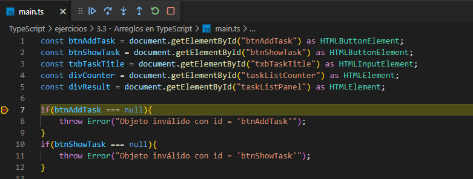

# Arreglos en TypeScript

En este ejercicio nos adentramos un poco en los tipos de datos más complejos de TypeScript para resolver una problemática muy común demostrando varios de los conceptos que te ayudaran a aterrizar el desarrollo de aplicaciones utilizando este lenguaje.

## Objetivos

Al completar este ejercicio tu deberás ser capaz de:

* Reforzar lo visto en el ejercicio inicial (3.1 - Simple TypeScript).
* Mostrar las opciones de configuración de `tsc`.
* *Debbugear* tu código TypeScript en VSCode.
* Mostrar y entender los arreglos en Typescript.

## Instrucciones

El siguiente ejercicio plantea la siguiente problemática:

***¿Cómo hacer una lista de tareas sencilla en TypeScript?***

Para resolver esta respuesta iremos desglosando cada uno de los objetivos antes planteados para dar una respuesta más completa y enfocada a un nivel básico.

#### Objetivo 1: Reforzar lo visto en el ejercicio anterior (3.1 - Simple TypeScript)

Ejecuta los siguientes pasos:

Paso 1: Configura tu entorno de trabajo como en el ejercicio inicial, llamado `3.1 - Simple TypeScript`.

#### Objetivo 2: Mostrar las opciones de configuración de `tsc`.

Paso 1: En la terminal ejecuta el siguiente comando.

```bash
tsc --init
```

Paso 3:  Edita el archivo tsconfig.json generado y remplaza su contenido por el siguiente

```json
{
  "compilerOptions": {
    /* Visit https://aka.ms/tsconfig to read more about this file */
    "target": "ES2022",
    "lib": ["ES2022", "DOM"],
    "module": "System",
    "rootDir": "./",
    "outFile": "dist/main.js",
    "esModuleInterop": true,
    "forceConsistentCasingInFileNames": true,
    "strict": true,
    "skipLibCheck": true,
    "sourceMap": true
  },"exclude": ["node_modules"]
}
```

Paso 4:  En la terminal ejecuta el siguiente comando.

```bash
tsc --watch
```

Podras observar que en se crea una carpeta llamada `dist` y en ella se observa un archivo `main.js`, mismo que es el resultado de la compilación de ambos archivos `*.ts` y que es utilizado por el archivo `index.html` para ejecutar tu programa.

Ahora, cada que ejecutes un cambio en tus archivos `*.ts` el compilador de TypeScript en automático recompilará todos los archivos y volverá a generar un nuevo archivo `main.js`.

#### Objetivo 3: Debbugear tu cádigo TypeScript en VSCode

Ejecuta los siguientes pasos:

Paso 1: Instala, desde las extencioes de VS Code, el '***debugger***'  que necesites para el explorador que esten ocupando.

    Nota: Para el explorador chrome/edge**no es necesario instalar** ningun '***debugger***' ya que esta incluido por defecto en VS Code.

Paso 2: Configura un nuevo archivo `launch.json` desde la sección "Run & Debug".

Paso 3: Valida que en tu archivo `tsconfig.json` existan las siguientes opciones.

```json
"rootDir": "./",
"sourceMap": true
```

Paso 4: Coloca un punto de ruptura en alguna línea de uno de tus archivos `*.ts`.

Paso 5:  Da clic en el botón verde (play) desde la sección "Run & Debug".

    Nota: Veras que una instancia de tu explorador web seleccionado se abre.

Paso 6: En una nueva terminal ejecuta el siguiente comando.

```bash
npm run start
```

Paso 7: Valida que tu  código sea *debuggeable* acorde a la siguiente imagen. Ahora disfruta probando tu aplicación desde VS Code.



#### Objetivo 4: Mostrar y entender los arreglos en Typescript

Ejecuta los siguientes pasos:

Paso 1: Edita el archivo `index.html` y coloca el siguiente código.

```html
<!DOCTYPE html>
<html lang="en">
  <head>
    <meta charset="utf-8" />
    <meta name="viewport" content="width=device-width, initial-scale=1" />
    <title>TypeScript 101 - TypeScript en detalle</title>
    <link
      href="https://cdn.jsdelivr.net/npm/bootstrap@5.3.2/dist/css/bootstrap.min.css"
      rel="stylesheet"
      integrity="sha384-T3c6CoIi6uLrA9TneNEoa7RxnatzjcDSCmG1MXxSR1GAsXEV/Dwwykc2MPK8M2HN"
      crossorigin="anonymous"
    />
  </head>
  <body>
    <div class="container">
        <div class="row">
            <h2>Tu lista de tareas</h2>
            <hr/><br/>
            <div class="col-6">            
                <div class="input-group">
                    <input id="txbTaskTitle" type="text" class="form-control" placeholder="Tu siguiente tarea">
                    <button class="btn btn-outline-primary" type="button" id="btnAddTask">Agregar</button>
                    <button class="btn btn-outline-secondary" type="button" id="btnShowTask">Mostrar/Ocultar</button>
                </div>
            </div>
            <div class="col-6">
                <div id="taskListCounter">
                    Tu lista tiene 0 elementos
                </div>
                <ul id="taskListPanel" class="list-group">
                    <!-- Elementos agregados dinamicamente -->
                </ul>
            </div>
        </div>  
    </div>
    <script src="dist/main.js"></script>
    <script src="https://cdn.jsdelivr.net/npm/bootstrap@5.3.2/dist/js/bootstrap.bundle.min.js"
      integrity="sha384-C6RzsynM9kWDrMNeT87bh95OGNyZPhcTNXj1NW7RuBCsyN/o0jlpcV8Qyq46cDfL"
      crossorigin="anonymous"
    ></script>
  </body>
</html>
```

Paso 2: Ahora agrega dos archivos `*.ts`. Uno llamado `main.ts` y otro llamado `utils.ts` y agrega respectivamente el siguiente contenido.

`main.ts`

```typescript
const btnAddTask = document.getElementById("btnAddTask") as HTMLButtonElement;
const btnShowTask = document.getElementById("btnShowTask") as HTMLButtonElement;
const txbTaskTitle = document.getElementById("txbTaskTitle") as HTMLInputElement;
const divCounter = document.getElementById("taskListCounter") as HTMLElement;
const divResult = document.getElementById("taskListPanel") as HTMLElement;

if(btnAddTask === null){
    throw Error("Objeto inválido con id = 'btnAddTask'");
}
if(btnShowTask === null){
    throw Error("Objeto inválido con id = 'btnShowTask'");
}

if(txbTaskTitle === null){
    throw Error("Objeto inválido con id = 'txbTaskTitle'");
}

if(divCounter === null){
    throw Error("Objeto inválido con id = 'divCounter'");
}

if(divResult === null){
    throw Error("Objeto inválido con id = 'taskListPanel'");
}

let taskList: string[] = [];

btnAddTask.addEventListener("click", () => {  
    updateCounterTitle();
    addTaskToArray(txbTaskTitle.value);

    txbTaskTitle.value = "";
});

btnShowTask.addEventListener("click", () => {
    clearTaskList();
    for (let index = 0; index < taskList.length; index++) {
        const element = taskList[index];
        addTaskToHtml(element)
    }
});
```

`utils.ts`

```typescript
///////////////////// utils ////////////////////////////
////////////////////////////////////////////////////////

function updateCounterTitle(): void{
    divCounter.innerHTML = `Tu lista tiene ${taskList.length} elementos`;  
}

function clearTaskList(): void {
    divResult.innerHTML = "";
 }

function addTaskToHtml(task: string): void {
    if (task !== "") {
        const liNode = document.createElement("li");
        const liText = document.createTextNode(task);

        liNode.className = "list-group-item";
        liNode.appendChild(liText);
        divResult.appendChild(liNode);    
    }
}

function addTaskToArray(task: string): void {
    if(task !== ""){
        taskList.push(task);
    }
}
```

## Resumen

En este ejercicio pudiste darte cuenta del uso que se le pueden dar a los arreglos en TypeScript mediante un pequeño ejemplo y como podemos continuar utilizando TypeScript para mejorar nuestro desarrollo (en este caso de aplicaciones web).

Manipulamos el [DOM ](https://developer.mozilla.org/en-US/docs/Web/API/Document_Object_Model/Introduction)de una página web y complementamos nuestro desarrollo JS con las bondades del fuerte tipado de TypeScript y las herramientas VS Code como entorno de trabajo.

Con todo lo anterior ya puedes comenzar a indagar mas en detalle sobre este lenguaje.

##### HAPPY CODING!!!!

Te invito a que si, hasta este punto, aun tienes una duda de los temas vistos en estos ejercicios. No dudes en comunicarte con tu servidor enviando tus dudas a mi correo <xavier.hernandez.app@outlook.com>.
